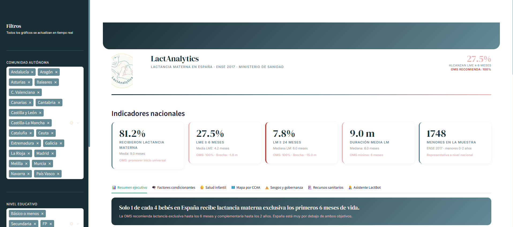

# 🤱 LactAnalytics

<div align="center">


**Dashboard interactivo de análisis de lactancia materna en España**

Módulo II · Análisis y Visualización de Datos · Bootcamp IA & Big Data · F5 · 2025

[](https://lactanalytics.streamlit.app)


[](https://www.linkedin.com/in/adriana-aranguez)

</div>

---

## 📋 Descripción del proyecto

LactAnalytics es una herramienta de Business Intelligence orientada a organizaciones del sector de la salud materno-infantil, especialmente **ONGs y asociaciones de lactancia materna** como LLL España o ACPAM.

El proyecto transforma los microdatos de la **Encuesta Nacional de Salud de España 2017 (ENSE)** en un cuadro de mando interactivo que responde preguntas estratégicas clave:

- ¿Qué porcentaje de bebés en España recibe lactancia materna exclusiva los primeros 6 meses?
- ¿Qué factores socioeconómicos condicionan la duración de la lactancia?
- ¿Existe relación entre la dotación de matronas por CCAA y el éxito de la lactancia?
- ¿Qué sesgos contienen los datos disponibles y qué impacto tendrían en decisiones de política sanitaria?

---

## 🖥️ Demo

[](https://lactanalytics.streamlit.app)
[](https://deepwiki.com/adrianaarang/LactAnalytics)



---

## 📊 Dataset

| Campo | Detalle |
|---|---|
| **Fuente principal** | Encuesta Nacional de Salud de España 2017 (ENSE) |
| **Organismo** | Ministerio de Sanidad / Instituto Nacional de Estadística (INE) |
| **Enlace** | [ine.es · Microdatos ENSE 2017](https://www.ine.es/dyngs/INEbase/es/operacion.htm?c=Estadistica_C&cid=1254736176783&menu=resultados&secc=1254736195295&idp=1254735573175) |
| **Ficheros utilizados** | `MICRODAT.CM` (menores) + `MICRODAT.CH` (hogar) |
| **Registros tras limpieza** | 1.764 menores de 0-4 años |
| **Variables** | 27 columnas (variables de lactancia, socioeconómicas y de salud infantil) |
| **Licencia** | Reutilización con atribución · CC BY 4.0 |
| **Fuente secundaria** | INE · Estadística de Profesionales Sanitarios Colegiados 2017 |
| **Fuente terciaria** | INE · Estadística de Nacimientos 2017 |

### Variables numéricas principales
`meses_lactancia_total`, `meses_lactancia_excl`, `edad_menor`, `clase_social`, `nivel_educativo_cod`, `imc`, `valoracion_salud`

### Variables categóricas principales
`ccaa`, `nivel_educativo_grupo`, `sexo_menor`, `lactancia_materna`, `lactancia_exclusiva`

---

## 🏗️ Estructura del proyecto

```
LactAnalytics/
│
├── app.py                          # Punto de entrada — configuración y orquestación
├── requirements.txt                # Dependencias del proyecto
├── .python-version                 # Python 3.11 para Streamlit Cloud
├── .env                            # Variables de entorno (no incluido en git)
├── logo.jpg                        # Logo corporativo
│
├── secciones/                      # Secciones del dashboard (una por tab)
│   ├── resumen_ejecutivo.py        # KPIs, curva de abandono, narrativa principal
│   ├── factores_condicionantes.py  # Clase social, educación, correlaciones
│   ├── salud_infantil.py           # Valoración salud, IMC, enfermedades crónicas
│   ├── mapa_ccaa.py                # Mapa coroplético + ranking territorial
│   ├── sesgos_gobernanza.py        # Análisis ético y limitaciones del dataset
│   ├── recursos_sanitarios.py      # Matronas por CCAA vs tasas de LME
│   └── asistente_lactancia.py      # Chat IA con LLaMA 3 (Groq)
│
├── src/                            # Lógica de negocio (separada de la UI)
│   ├── data_loader.py              # Carga, limpieza y fusión ENSE 2017
│   ├── data_loader_recursos.py     # Carga matronas y nacimientos por CCAA
│   ├── stats.py                    # KPIs, correlaciones, KDE, tablas dinámicas
│   ├── charts.py                   # Funciones de gráficos Plotly reutilizables
│   └── config.py                   # Paleta de colores y constantes globales
│
├── data/
│   ├── raw/                        # Datos originales del INE (excluidos de git)
│   └── processed/                  # Datasets limpios (versionados)
│       ├── lactancia_clean.csv     # Dataset principal (1.764 × 27)
│       └── matronas_lme_ccaa.csv   # Ratio matronas/nacimientos por CCAA
│
├── notebooks/
│   ├── 01_eda.ipynb                # Exploración inicial, nulos, distribuciones
│   └── 02_analisis_estadistico.ipynb # Correlaciones, KDE, tests estadísticos
│
└── docs/
    ├── decision_herramienta.md     # Justificación Streamlit vs Power BI
    ├── gobernanza_sesgos.md        # Análisis ético detallado
    └── screenshot.png              # Captura del dashboard en producción
```

---

## 🛠️ Tecnologías utilizadas

| Tecnología | Uso | Justificación |
|---|---|---|
| **Streamlit** | Framework del dashboard | Despliegue inmediato, Python nativo, multipage con tabs |
| **Plotly** | Gráficos interactivos | Interactividad cruzada, hover, zoom sin código adicional |
| **Pandas** | Manipulación de datos | Estándar de facto para análisis tabular en Python |
| **NumPy** | Cálculos estadísticos | Operaciones vectorizadas eficientes |
| **SciPy** | Estadística avanzada | KDE, tests Kruskal-Wallis, Chi-cuadrado, correlaciones |
| **Groq + LLaMA 3** | Asistente IA | API gratuita, modelo de alta calidad, latencia mínima |
| **python-dotenv** | Gestión de secretos | Separación segura de credenciales del código |

### ¿Por qué Streamlit y no Power BI?

Streamlit permite código modular en Python, integración directa con librerías estadísticas como SciPy, despliegue gratuito en Streamlit Community Cloud con URL pública, y control total del diseño visual y la narrativa. Power BI requeriría licencia para el despliegue público y limitaría la integración del asistente de IA.

---

## 🚀 Instalación y ejecución local

```bash
# 1. Clonar el repositorio
git clone https://github.com/adrianaarang/LactAnalytics.git
cd LactAnalytics

# 2. Crear entorno virtual
python -m venv venv
venv\Scripts\activate       # Windows
# source venv/bin/activate  # Mac/Linux

# 3. Instalar dependencias
pip install -r requirements.txt

# 4. Configurar variables de entorno
# Crear archivo .env en la raíz con:
# GROQ_API_KEY="gsk_..."

# 5. Descargar los datos del INE (ver sección Dataset)
# Colocar ficheros en data/raw/

# 6. Generar los datasets procesados
python src/data_loader.py
python src/data_loader_recursos.py

# 7. Ejecutar el dashboard
streamlit run app.py
```

El dashboard estará disponible en `http://localhost:8501`

---

## 📈 Secciones del dashboard

| Sección | Descripción | Gráficos |
|---|---|---|
| 📊 Resumen ejecutivo | Narrativa principal, KPIs vs OMS, curva de abandono | Curva abandono, KDE, barras educación, comparativa OMS |
| 🎓 Factores condicionantes | Determinantes socioeconómicos de la lactancia | Box plots, KDE por grupos, scatter, heatmap correlación |
| 👶 Salud infantil | Relación lactancia-salud infantil con evidencia científica | Barras salud, IMC categorías, enfermedades crónicas |
| 🗺️ Mapa por CCAA | Análisis territorial con mapa coroplético interactivo | Mapa España, ranking CCAA, tabla dinámica |
| ⚠️ Sesgos y gobernanza | Auditoría ética y limitaciones del dataset | Mapa nulos, distribución muestral, impacto decisiones |
| 🏥 Recursos sanitarios | Matronas por CCAA vs tasas de LME — análisis propio | Scatter correlación, ranking ratio, bubble chart |
| 🤱 Asistente LactBot | Chat IA especializado en lactancia (OMS/AEPED/ABM) | Interfaz conversacional con preguntas sugeridas |

---

## 🔍 Hallazgos principales

- Solo el **27,5%** de los bebés en España alcanza los 6 meses de lactancia exclusiva recomendados por la OMS (objetivo: 100%)
- Las madres universitarias tienen **71% más probabilidad** de alcanzar LME 6 meses que las de estudios básicos
- **Castilla y León (38,7%)** y **Castilla-La Mancha (38,2%)** lideran el ranking autonómico
- La brecha entre mejor y peor CCAA supera los **20 puntos porcentuales**
- Correlación moderada entre dotación de matronas y tasas de LME (r=0.52), aunque limitada por la calidad del registro de colegiación del INE

---

## ⚠️ Sesgos y limitaciones documentadas

| Sesgo | Nivel | Impacto |
|---|---|---|
| Sesgo de memoria (autodeclaración) | 🔴 Alto | Sobreestimación de tasas de LME |
| Subrepresentación población migrante | 🔴 Alto | Resultados no extrapolables al 100% de la población |
| No respuesta en ingresos (55,3% nulos) | 🔴 Alto | Análisis socioeconómico limitado |
| Brecha urbano-rural no controlada | 🟡 Medio | Diferencias CCAA pueden estar confundidas |
| Datos transversales, no longitudinales | 🟡 Medio | No permite establecer causalidad |
| Muestra pequeña en algunas CCAA | 🟢 Bajo | Ceuta, Melilla, La Rioja con n < 30 |

---

## 🤖 Asistente LactBot

El asistente utiliza el modelo **LLaMA 3.3 70B** a través de la API de Groq (gratuita). El system prompt está blindado para:

- Responder solo sobre lactancia materna basándose en OMS, AEPED, ABM y LLL España
- Derivar siempre a profesionales sanitarios ante consultas clínicas
- No recomendar marcas comerciales ni dar diagnósticos
- Responder siempre en español con tono empático

Para activarlo localmente, añade tu `GROQ_API_KEY` en el archivo `.env`.

---

## 📁 Datos no incluidos en el repositorio

Los ficheros de datos brutos (`data/raw/`) están excluidos por su tamaño. Para reproducir el análisis descarga del INE:

| Fichero | Fuente |
|---|---|
| `ense2017_menor_xlsx.xlsx` | [INE · ENSE 2017 · Microdatos menor](https://www.ine.es/dyngs/INEbase/es/operacion.htm?c=Estadistica_C&cid=1254736176783&menu=resultados&secc=1254736195295&idp=1254735573175) |
| `ense2017_hogar_xlsx.xlsx` | [INE · ENSE 2017 · Microdatos hogar](https://www.ine.es/dyngs/INEbase/es/operacion.htm?c=Estadistica_C&cid=1254736176783&menu=resultados&secc=1254736195295&idp=1254735573175) |
| `matronas.xlsx` | [INE · Profesionales Sanitarios Colegiados 2017](https://www.ine.es/dyngs/INEbase/es/operacion.htm?c=Estadistica_C&cid=1254736176781&menu=resultados&idp=1254735573175) |
| `nacimientos.xlsx` | [INE · Indicadores de Natalidad 2017](https://www.ine.es/dyngs/INEbase/es/operacion.htm?c=Estadistica_C&cid=1254736176998&menu=resultados&idp=1254735573002) |

---

## 👩‍💻 Autora

**Adriana Aranguez**  
Full Stack Developer · IT Analyst · Especialización en IA & Big Data  
Bootcamp F5 · 2025

[](https://www.linkedin.com/in/adriana-aranguez)
[](https://github.com/adrianaarang)

---

## 📄 Licencia

Los datos utilizados proceden de fuentes abiertas del INE con licencia **CC BY 4.0**.  
El código de este proyecto está disponible bajo licencia **MIT**.

> **Cita requerida para uso de datos:**  
> Fuente: INE, [www.ine.es](https://www.ine.es) · Encuesta Nacional de Salud de España 2017
